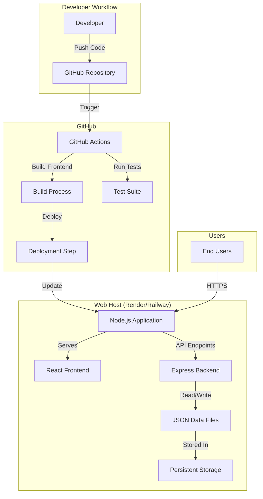
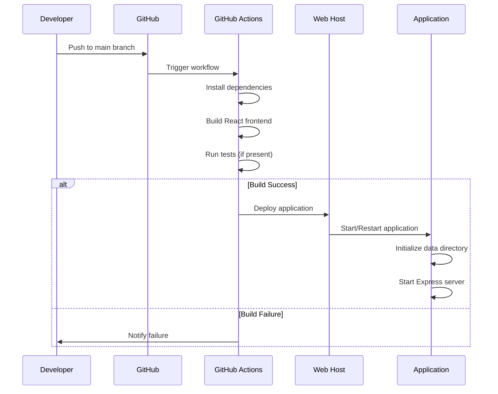

# Design Document: GitHub Web Deployment

## Overview

This design outlines the deployment architecture for the team certification management application to GitHub and a web hosting platform. The application consists of a Node.js/Express.js backend serving a React.js frontend, with JSON file-based data storage. The deployment strategy focuses on using GitHub for version control and CI/CD, with deployment to a Node.js-compatible hosting platform (Render, Railway, or similar).

The key design decisions include:
- Single repository containing both frontend and backend code
- Express backend serving the built React frontend as static files
- Environment-based configuration for flexible deployment
- GitHub Actions for automated build and deployment
- Free-tier compatible hosting platform selection
- File-based data persistence with clear backup/restore procedures

## Architecture

### High-Level Architecture



### Deployment Flow



## Components and Interfaces

### 1. Repository Structure

The GitHub repository will be organized as follows:

```
team-cert-management/
├── client/                 # React frontend
│   ├── public/
│   ├── src/
│   ├── package.json
│   └── .env.example
├── server/                 # Express backend
│   ├── routes/
│   ├── controllers/
│   ├── models/
│   ├── server.js
│   └── package.json
├── data/                   # JSON data files (gitignored)
├── .github/
│   └── workflows/
│       └── deploy.yml      # GitHub Actions workflow
├── .gitignore
├── .env.example
├── package.json            # Root package.json for deployment
├── README.md
└── DEPLOYMENT.md
```

### 2. Configuration Management Component

**Purpose**: Manage environment-specific configuration

**Interface**:
```javascript
// config.js
const config = {
  port: process.env.PORT || 3001,
  nodeEnv: process.env.NODE_ENV || 'development',
  dataDir: process.env.DATA_DIR || './data',
  corsOrigin: process.env.CORS_ORIGIN || 'http://localhost:3000',
  frontendBuildPath: process.env.FRONTEND_BUILD_PATH || '../client/build'
};

function validateConfig() {
  // Validates required configuration
  // Throws error if critical config is missing
}

module.exports = { config, validateConfig };
```

**Environment Variables**:
- `PORT`: Server port (default: 3001)
- `NODE_ENV`: Environment mode (development/production)
- `DATA_DIR`: Directory for JSON data files
- `CORS_ORIGIN`: Allowed CORS origins (comma-separated)
- `FRONTEND_BUILD_PATH`: Path to built React files

### 3. Server Component (Express Backend)

**Purpose**: Serve API endpoints and static frontend files

**Key Modifications**:
```javascript
// server.js
const express = require('express');
const path = require('path');
const cors = require('cors');
const { config, validateConfig } = require('./config');

const app = express();

// Validate configuration on startup
validateConfig();

// CORS configuration
const corsOptions = {
  origin: config.corsOrigin.split(',').map(o => o.trim()),
  credentials: true
};
app.use(cors(corsOptions));

// API routes
app.use('/api', apiRoutes);

// Serve static files from React build
if (config.nodeEnv === 'production') {
  const frontendPath = path.resolve(__dirname, config.frontendBuildPath);
  app.use(express.static(frontendPath));
  
  // Handle client-side routing
  app.get('*', (req, res) => {
    res.sendFile(path.join(frontendPath, 'index.html'));
  });
}

// Health check endpoint
app.get('/health', (req, res) => {
  res.status(200).json({ 
    status: 'healthy', 
    timestamp: new Date().toISOString(),
    environment: config.nodeEnv
  });
});

app.listen(config.port, () => {
  console.log(`Server running on port ${config.port}`);
  console.log(`Environment: ${config.nodeEnv}`);
  console.log(`Data directory: ${config.dataDir}`);
});
```

### 4. Data Persistence Component

**Purpose**: Manage JSON file storage with initialization

**Interface**:
```javascript
// dataManager.js
const fs = require('fs').promises;
const path = require('path');
const { config } = require('./config');

async function initializeDataDirectory() {
  try {
    await fs.access(config.dataDir);
  } catch {
    await fs.mkdir(config.dataDir, { recursive: true });
    console.log(`Created data directory: ${config.dataDir}`);
  }
}

async function readData(filename) {
  const filePath = path.join(config.dataDir, filename);
  try {
    const data = await fs.readFile(filePath, 'utf8');
    return JSON.parse(data);
  } catch (error) {
    if (error.code === 'ENOENT') {
      return null; // File doesn't exist
    }
    throw error;
  }
}

async function writeData(filename, data) {
  const filePath = path.join(config.dataDir, filename);
  await fs.writeFile(filePath, JSON.stringify(data, null, 2), 'utf8');
}

module.exports = { initializeDataDirectory, readData, writeData };
```

### 5. Build Process Component

**Purpose**: Compile and bundle frontend for production

**Root package.json scripts**:
```json
{
  "scripts": {
    "install-all": "npm install && cd client && npm install && cd ../server && npm install",
    "build": "cd client && npm run build",
    "start": "cd server && node server.js",
    "dev:client": "cd client && npm start",
    "dev:server": "cd server && npm run dev",
    "test": "cd server && npm test && cd ../client && npm test"
  }
}
```

### 6. GitHub Actions Workflow

**Purpose**: Automate build, test, and deployment

**Workflow file** (`.github/workflows/deploy.yml`):
```yaml
name: Deploy to Web Host

on:
  push:
    branches: [ main ]
  pull_request:
    branches: [ main ]

jobs:
  build-and-test:
    runs-on: ubuntu-latest
    
    steps:
    - uses: actions/checkout@v3
    
    - name: Setup Node.js
      uses: actions/setup-node@v3
      with:
        node-version: '18'
        cache: 'npm'
    
    - name: Install dependencies
      run: npm run install-all
    
    - name: Build frontend
      run: npm run build
    
    - name: Run tests
      run: npm test
      continue-on-error: true
    
    - name: Upload build artifacts
      uses: actions/upload-artifact@v3
      with:
        name: build
        path: client/build/

  deploy:
    needs: build-and-test
    runs-on: ubuntu-latest
    if: github.ref == 'refs/heads/main'
    
    steps:
    - name: Deploy to Render/Railway
      run: echo "Deployment handled by platform webhook"
      # Platform-specific deployment happens via webhook
```

### 7. Web Host Configuration

**Recommended Platform**: Render or Railway (both offer free tiers)

**Render Configuration** (`render.yaml`):
```yaml
services:
  - type: web
    name: team-cert-management
    env: node
    buildCommand: npm run install-all && npm run build
    startCommand: npm start
    envVars:
      - key: NODE_ENV
        value: production
      - key: PORT
        generateValue: true
      - key: DATA_DIR
        value: /opt/render/project/data
    disk:
      name: data-disk
      mountPath: /opt/render/project/data
      sizeGB: 1
```

**Railway Configuration**:
- Connect GitHub repository
- Set build command: `npm run install-all && npm run build`
- Set start command: `npm start`
- Configure environment variables in dashboard
- Enable persistent volume for data directory

## Data Models

### Configuration Model

```javascript
{
  port: Number,              // Server port
  nodeEnv: String,           // 'development' | 'production'
  dataDir: String,           // Path to data directory
  corsOrigin: String,        // Comma-separated origins
  frontendBuildPath: String  // Path to React build
}
```

### Health Check Response Model

```javascript
{
  status: String,      // 'healthy' | 'unhealthy'
  timestamp: String,   // ISO 8601 timestamp
  environment: String, // Current NODE_ENV
  version: String      // Optional: application version
}
```

### Deployment Metadata Model

```javascript
{
  deployedAt: String,     // ISO 8601 timestamp
  commitSha: String,      // Git commit hash
  branch: String,         // Git branch name
  buildNumber: Number,    // CI/CD build number
  deployer: String        // GitHub username or 'automated'
}
```

## Data Models (Existing Application)

The existing application data models remain unchanged. The deployment design accommodates the current JSON file structure without modification.


## Correctness Properties

*A property is a characteristic or behavior that should hold true across all valid executions of a system—essentially, a formal statement about what the system should do. Properties serve as the bridge between human-readable specifications and machine-verifiable correctness guarantees.*

### Property 1: Environment Variable Configuration

*For any* environment-specific configuration value (port, data directory, CORS origins), when an environment variable is set, the application should use that value instead of the default.

**Validates: Requirements 2.1**

### Property 2: Data Directory Management

*For any* configured data directory path, the application should create the directory if it doesn't exist and successfully write data files to that location.

**Validates: Requirements 3.1, 3.4**

### Property 3: Static File Serving in Production

*For any* valid static file path in the React build directory, when the application is in production mode, requesting that path should return the file with appropriate content type headers.

**Validates: Requirements 2.5, 9.2**

### Property 4: Routing Separation

*For any* HTTP request, if the path starts with `/api`, it should be routed to the Express backend handlers; otherwise, it should serve the React application for client-side routing.

**Validates: Requirements 9.4, 9.5**

### Property 5: CORS Configuration

*For any* configured CORS origin (via environment variable or default), requests from that origin should be allowed, and requests from non-configured origins should be rejected.

**Validates: Requirements 7.1, 7.2**

### Property 6: Environment Variable Validation

*For any* required environment variable, if it is missing on startup, the application should log a clear error message indicating which variable is needed and prevent startup.

**Validates: Requirements 6.4, 6.5**

### Property 7: Security Headers in Production

*For any* HTTP response in production mode, the response should include appropriate security headers (e.g., X-Content-Type-Options, X-Frame-Options).

**Validates: Requirements 7.3**

### Property 8: Development Feature Isolation

*For any* development-only feature (verbose logging, hot reload endpoints), when NODE_ENV is set to production, that feature should be disabled.

**Validates: Requirements 7.4**

### Property 9: Relative Path Resolution

*For any* file path used by the application (data files, static assets), the path should resolve correctly regardless of the current working directory or deployment environment.

**Validates: Requirements 2.6**

### Property 10: Error Logging Detail

*For any* error that occurs during request processing, the logged error should include sufficient context (timestamp, request path, error message, stack trace) for troubleshooting.

**Validates: Requirements 10.5**

## Error Handling

### Configuration Errors

**Missing Required Environment Variables**:
- Validate all required configuration on startup
- Log clear error messages indicating which variables are missing
- Exit with non-zero status code to prevent deployment of misconfigured application

**Invalid Configuration Values**:
- Validate configuration value formats (e.g., port numbers, directory paths)
- Log descriptive error messages
- Use safe defaults where appropriate

### Data Persistence Errors

**Data Directory Creation Failure**:
- Log error with full path and permission details
- Attempt to use fallback temporary directory
- If all attempts fail, exit with error

**File Read/Write Errors**:
- Catch and log file system errors with context
- Return appropriate HTTP error codes (500 for server errors)
- Include error details in response for debugging (in development mode only)

### Build and Deployment Errors

**Frontend Build Failure**:
- GitHub Actions should fail the workflow
- Log build errors clearly
- Prevent deployment of broken builds

**Missing Build Artifacts**:
- Server should check for build directory on startup
- Log clear error if build directory is missing
- Provide instructions for running build command

### Runtime Errors

**Unhandled Route Errors**:
- Catch all unhandled routes
- Return 404 with helpful message
- Log attempted route for debugging

**Server Startup Errors**:
- Catch port binding errors
- Log clear message if port is already in use
- Suggest alternative ports or process cleanup

### Health Check Errors

**Unhealthy State Detection**:
- Health check should verify critical dependencies
- Return 503 status code if unhealthy
- Include diagnostic information in response

## Testing Strategy

### Dual Testing Approach

This deployment project requires both unit tests and property-based tests to ensure comprehensive coverage:

- **Unit tests**: Verify specific configuration examples, file existence checks, and deployment workflow steps
- **Property tests**: Verify universal properties across different configuration values and runtime scenarios

### Unit Testing Focus

Unit tests should focus on:
- Specific configuration examples (default values, specific environment variable combinations)
- File existence and content verification (.gitignore, README.md, workflow files)
- Health check endpoint responses
- Specific routing examples (root path, API paths, client-side routes)
- Build process verification (output files exist after build)

### Property-Based Testing Focus

Property tests should focus on:
- Environment variable configuration across all possible values
- Data directory creation and file operations with various paths
- Static file serving for any valid file in the build directory
- Routing behavior for any request path
- CORS configuration for any origin value
- Security headers for any request in production mode
- Error logging for any error type

### Property-Based Testing Configuration

**Library Selection**: 
- For Node.js/JavaScript: Use `fast-check` library
- Install: `npm install --save-dev fast-check`

**Test Configuration**:
- Each property test must run minimum 100 iterations
- Each test must reference its design document property
- Tag format: `// Feature: github-web-deployment, Property N: [property text]`

**Example Property Test Structure**:
```javascript
const fc = require('fast-check');

describe('Property Tests', () => {
  it('should use environment variable for any config value', () => {
    // Feature: github-web-deployment, Property 1: Environment Variable Configuration
    fc.assert(
      fc.property(
        fc.integer({ min: 1024, max: 65535 }), // Generate random port
        (port) => {
          process.env.PORT = port.toString();
          const config = loadConfig();
          expect(config.port).toBe(port);
        }
      ),
      { numRuns: 100 }
    );
  });
});
```

### Integration Testing

**Deployment Workflow Testing**:
- Test GitHub Actions workflow locally using `act` tool
- Verify build process completes successfully
- Verify deployment steps execute in correct order

**End-to-End Testing**:
- Deploy to staging environment
- Verify application is accessible via HTTPS
- Test all API endpoints
- Verify frontend loads and functions correctly
- Test data persistence across restarts

### Manual Testing Checklist

Before production deployment:
- [ ] Verify GitHub repository is properly configured
- [ ] Verify all environment variables are set on hosting platform
- [ ] Verify build completes successfully
- [ ] Verify application starts without errors
- [ ] Verify health check endpoint returns 200
- [ ] Verify frontend loads in browser
- [ ] Verify API endpoints respond correctly
- [ ] Verify data persistence works
- [ ] Verify CORS allows frontend requests
- [ ] Verify HTTPS is enabled

### Continuous Testing

**On Every Push**:
- Run unit tests
- Run property-based tests
- Build frontend
- Verify no linting errors

**On Deployment**:
- Run full test suite
- Verify health check after deployment
- Monitor logs for errors
- Verify application is accessible

## Deployment Procedures

### Initial Deployment Setup

1. **Create GitHub Repository**:
   - Initialize repository with existing code
   - Add .gitignore, README.md, and .env.example
   - Push initial commit

2. **Configure Web Host** (Render/Railway):
   - Connect GitHub repository
   - Set environment variables
   - Configure build and start commands
   - Enable persistent storage for data directory
   - Set up custom domain (optional)

3. **Configure GitHub Actions**:
   - Add workflow file
   - Configure secrets if needed
   - Test workflow with a push

4. **Verify Deployment**:
   - Check application is accessible
   - Test all functionality
   - Verify data persistence
   - Monitor logs

### Update Deployment

1. Make code changes locally
2. Test changes locally
3. Commit and push to main branch
4. GitHub Actions automatically builds and tests
5. Platform automatically deploys if build succeeds
6. Verify deployment via health check
7. Monitor logs for errors

### Rollback Procedure

1. Identify the last known good commit
2. Revert to that commit: `git revert <commit-sha>`
3. Push revert commit to trigger redeployment
4. Alternatively, use platform's rollback feature if available

### Data Backup and Restore

**Backup**:
1. Access the hosting platform's file system or use SSH
2. Copy all files from the data directory
3. Store backup in secure location (e.g., separate Git repository, cloud storage)
4. Automate backups using platform's scheduled tasks or cron jobs

**Restore**:
1. Access the hosting platform's file system
2. Copy backup files to the data directory
3. Restart application if needed
4. Verify data is accessible

## Monitoring and Maintenance

### Health Monitoring

- Use platform's built-in health checks pointing to `/health` endpoint
- Set up uptime monitoring (e.g., UptimeRobot, Pingdom)
- Configure alerts for downtime

### Log Monitoring

- Review application logs regularly
- Set up log aggregation if available
- Monitor for error patterns
- Track deployment success/failure

### Performance Monitoring

- Monitor response times
- Track memory usage
- Monitor disk space (for data directory)
- Set up alerts for resource exhaustion

### Security Updates

- Regularly update dependencies: `npm audit fix`
- Monitor for security advisories
- Test updates in staging before production
- Keep Node.js version up to date

## Documentation Requirements

### README.md Contents

- Application description and features
- Local development setup instructions
- Environment variable documentation
- Build and deployment instructions
- API endpoint documentation
- Troubleshooting guide

### DEPLOYMENT.md Contents

- Detailed deployment setup for each platform (Render, Railway)
- Environment variable configuration
- Data persistence setup
- Backup and restore procedures
- Rollback procedures
- Monitoring setup
- Common deployment issues and solutions

### .env.example Contents

```
# Server Configuration
PORT=3001
NODE_ENV=development

# Data Storage
DATA_DIR=./data

# CORS Configuration
CORS_ORIGIN=http://localhost:3000

# Frontend Build Path
FRONTEND_BUILD_PATH=../client/build
```

## Platform-Specific Considerations

### Render

**Advantages**:
- Free tier with persistent disk
- Automatic HTTPS
- Easy GitHub integration
- Built-in health checks

**Configuration**:
- Use `render.yaml` for infrastructure as code
- Configure persistent disk for data directory
- Set environment variables in dashboard
- Use build command: `npm run install-all && npm run build`
- Use start command: `npm start`

### Railway

**Advantages**:
- Simple deployment process
- Automatic HTTPS
- Good free tier
- Easy environment variable management

**Configuration**:
- Connect GitHub repository
- Set build command: `npm run install-all && npm run build`
- Set start command: `npm start`
- Configure environment variables in dashboard
- Enable persistent volume for data directory

### Alternative: Heroku

**Advantages**:
- Well-documented
- Mature platform
- Good add-on ecosystem

**Configuration**:
- Use Procfile: `web: npm start`
- Set buildpacks for Node.js
- Configure environment variables via CLI or dashboard
- Note: Free tier no longer available

## Security Considerations

### Environment Variables

- Never commit .env files to repository
- Use platform's secure environment variable storage
- Rotate sensitive credentials regularly
- Use different credentials for staging and production

### CORS Configuration

- Configure specific origins, avoid wildcards in production
- Use environment variables for origin configuration
- Test CORS configuration thoroughly

### Data Security

- Ensure data directory is not publicly accessible
- Implement authentication if handling sensitive data
- Use HTTPS for all communication
- Regular security audits of dependencies

### API Security

- Implement rate limiting if needed
- Validate all input data
- Use appropriate HTTP methods
- Return appropriate error codes without exposing internals
