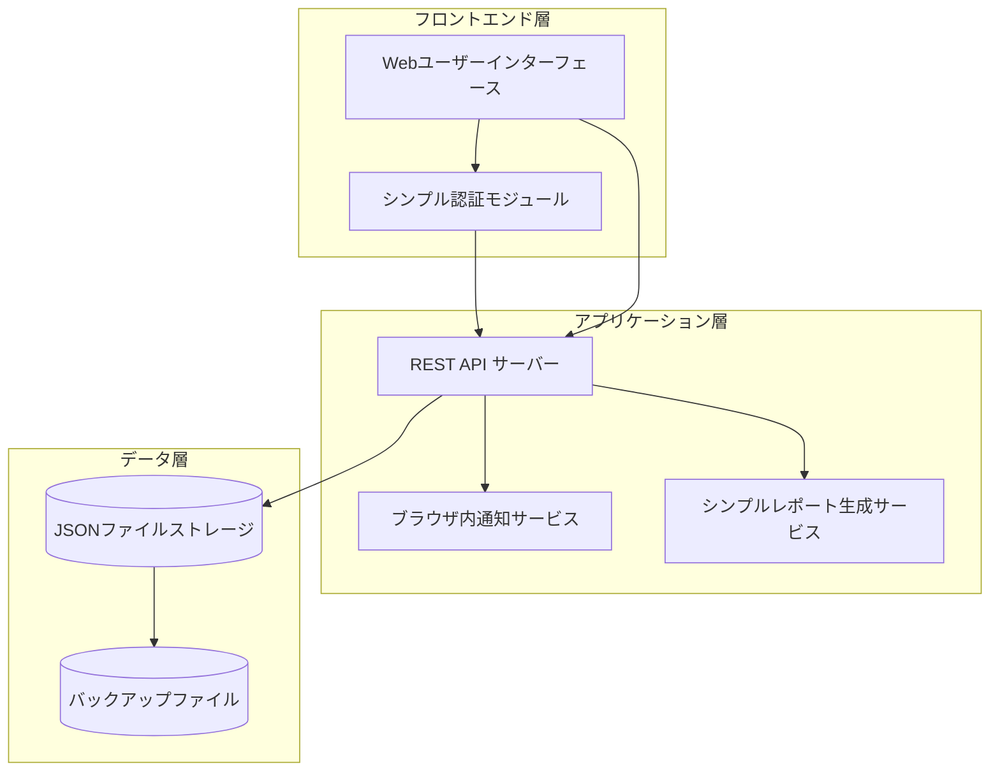
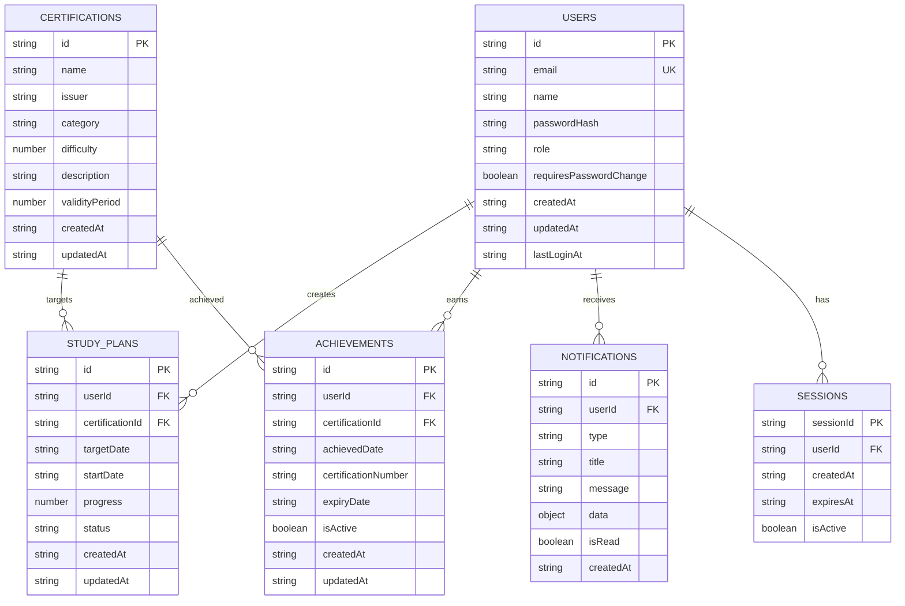

# 設計書（デモ版）

## 概要

チーム資格管理システム（デモ版）は、設計の妥当性を検証するためのローカルホスト可能なWebアプリケーションです。PostgreSQLの代わりにJSONファイルベースのストレージ、シンプルなセッション管理、ブラウザ内通知を使用して、コア機能を実装します。

## アーキテクチャ

### システム全体構成（デモ版）



### 技術スタック（デモ版）

- **フロントエンド**: React.js with TypeScript
- **バックエンド**: Node.js with Express.js
- **データストレージ**: JSONファイル（ファイルシステム）
- **認証**: シンプルなセッション管理（メモリベース）
- **通知**: ブラウザ内通知のみ
- **レポート**: HTML形式（PDF機能は後回し）
- **スタイリング**: CSS Modules または Styled Components
- **状態管理**: React Context API または Redux Toolkit
- **ルーティング**: React Router
- **フォーム管理**: React Hook Form
- **HTTP通信**: Axios
- **UI コンポーネント**: Material-UI または Ant Design（オプション）

## フロントエンド設計（UI/UX）

### 画面構成

#### 1. ログイン画面 (`/login`)
- **目的**: ユーザー認証
- **コンポーネント**: 
  - メールアドレス入力フィールド
  - パスワード入力フィールド
  - ログインボタン
  - エラーメッセージ表示エリア
- **機能**: 
  - フォームバリデーション
  - ログイン処理
  - セッション管理

#### 2. ダッシュボード画面 (`/dashboard`)
- **目的**: システムの概要表示
- **管理者向けコンポーネント**:
  - チーム統計カード（総資格数、アクティブプラン数、今月の取得数）
  - 期限切れ間近の計画一覧
  - 最近の取得実績
  - 通知バー
- **メンバー向けコンポーネント**:
  - 個人統計カード（進行中プラン、取得済み資格、進捗率）
  - 自分の学習計画一覧
  - 期限が近い計画のアラート
  - 通知バー

#### 3. 資格管理画面 (`/certifications`)
- **目的**: 資格情報の管理（管理者のみ）
- **コンポーネント**:
  - 資格一覧テーブル（検索・フィルタ機能付き）
  - 新規資格追加ボタン
  - 編集・削除アクション
  - 資格詳細モーダル
  - カテゴリ別フィルタ

#### 4. 学習計画管理画面 (`/study-plans`)
- **目的**: 学習計画の作成・管理
- **コンポーネント**:
  - 自分の計画一覧（進捗バー付き）
  - 新規計画作成ボタン
  - 進捗更新機能
  - 計画編集・削除機能
  - ステータス別フィルタ

#### 5. 取得履歴管理画面 (`/achievements`)
- **目的**: 取得済み資格の管理
- **コンポーネント**:
  - 取得済み資格一覧
  - 新規取得報告ボタン
  - 有効期限アラート
  - 資格更新機能
  - カテゴリ別表示

#### 6. ユーザー管理画面 (`/users`) - 管理者のみ
- **目的**: チームメンバーの管理
- **コンポーネント**:
  - ユーザー一覧テーブル
  - 新規ユーザー作成ボタン
  - 権限変更機能
  - ユーザー詳細表示
  - パスワードリセット機能

#### 7. レポート画面 (`/reports`) - 管理者のみ
- **目的**: 各種レポートの表示・出力
- **コンポーネント**:
  - 期間別レポート生成
  - 個人別レポート生成
  - グラフ・チャート表示
  - HTML/PDF出力機能

### UI/UXデザイン原則

#### レスポンシブデザイン
- **デスクトップ**: 1200px以上 - フル機能表示
- **タブレット**: 768px-1199px - 適応的レイアウト
- **スマートフォン**: 767px以下 - モバイル最適化

#### アクセシビリティ
- WCAG 2.1 AA準拠
- キーボードナビゲーション対応
- スクリーンリーダー対応
- 適切なコントラスト比

#### ユーザビリティ
- 直感的なナビゲーション
- 一貫したデザインパターン
- 明確なフィードバック
- エラーメッセージの分かりやすさ

### コンポーネント設計

#### 共通コンポーネント
```typescript
// ナビゲーションバー
interface NavigationBarProps {
  user: User;
  onLogout: () => void;
  notifications: Notification[];
}

// 通知バー
interface NotificationBarProps {
  notifications: Notification[];
  onMarkAsRead: (id: string) => void;
  onClearAll: () => void;
}

// データテーブル
interface DataTableProps<T> {
  data: T[];
  columns: TableColumn<T>[];
  onEdit?: (item: T) => void;
  onDelete?: (item: T) => void;
  searchable?: boolean;
  filterable?: boolean;
}

// フォームコンポーネント
interface FormFieldProps {
  label: string;
  name: string;
  type: 'text' | 'email' | 'password' | 'date' | 'select';
  required?: boolean;
  validation?: ValidationRule[];
  options?: SelectOption[];
}
```

#### ページコンポーネント
```typescript
// ダッシュボードページ
interface DashboardPageProps {
  userRole: UserRole;
}

// 資格管理ページ
interface CertificationManagementPageProps {
  certifications: Certification[];
  onCreateCertification: (data: CreateCertificationRequest) => void;
  onUpdateCertification: (id: string, data: UpdateCertificationRequest) => void;
  onDeleteCertification: (id: string) => void;
}
```

### 状態管理設計

#### Context API構造
```typescript
// 認証コンテキスト
interface AuthContextType {
  user: User | null;
  sessionId: string | null;
  login: (email: string, password: string) => Promise<void>;
  logout: () => void;
  isAuthenticated: boolean;
}

// 通知コンテキスト
interface NotificationContextType {
  notifications: Notification[];
  addNotification: (notification: NotificationRequest) => void;
  markAsRead: (id: string) => void;
  clearNotifications: () => void;
}

// データコンテキスト
interface DataContextType {
  certifications: Certification[];
  studyPlans: StudyPlan[];
  achievements: Achievement[];
  users: User[];
  refreshData: () => Promise<void>;
}
```

## コンポーネントとインターフェース

### 1. 認証・認可コンポーネント（簡素化版）

**SimpleAuthenticationService**
```typescript
interface SimpleAuthenticationService {
  login(email: string, password: string): Promise<AuthResult>
  logout(sessionId: string): Promise<void>
  validateSession(sessionId: string): Promise<UserInfo>
  changePassword(userId: string, oldPassword: string, newPassword: string): Promise<void>
}

interface AuthResult {
  sessionId: string
  user: UserInfo
  requiresPasswordChange: boolean
}
```

**SimpleAuthorizationService**
```typescript
interface SimpleAuthorizationService {
  hasPermission(sessionId: string, resource: string, action: string): Promise<boolean>
  getUserRole(sessionId: string): Promise<UserRole>
}

enum UserRole {
  ADMIN = "admin",
  MEMBER = "member"
}
```

### 2. ユーザー管理コンポーネント

**UserManagementService**
```typescript
interface UserManagementService {
  createUser(userData: CreateUserRequest): Promise<User>
  updateUser(userId: string, userData: UpdateUserRequest): Promise<User>
  deleteUser(userId: string): Promise<void>
  getUser(userId: string): Promise<User>
  listUsers(): Promise<User[]>
}

interface User {
  id: string
  email: string
  name: string
  role: UserRole
  createdAt: Date
  lastLoginAt?: Date
  requiresPasswordChange: boolean
}
```

### 3. 資格情報管理コンポーネント

**CertificationService**
```typescript
interface CertificationService {
  createCertification(certData: CreateCertificationRequest): Promise<Certification>
  updateCertification(certId: string, certData: UpdateCertificationRequest): Promise<Certification>
  deleteCertification(certId: string): Promise<void>
  getCertification(certId: string): Promise<Certification>
  listCertifications(filters?: CertificationFilters): Promise<Certification[]>
  searchCertifications(query: string): Promise<Certification[]>
}

interface Certification {
  id: string
  name: string
  issuer: string
  category: CertificationCategory
  difficulty: DifficultyLevel
  description: string
  validityPeriod?: number // months
  createdAt: Date
  updatedAt: Date
}

enum CertificationCategory {
  CLOUD = "cloud",
  SECURITY = "security",
  PROGRAMMING = "programming",
  DATABASE = "database",
  NETWORK = "network",
  PROJECT_MANAGEMENT = "project_management"
}
```

### 4. 資格取得計画管理コンポーネント

**StudyPlanService**
```typescript
interface StudyPlanService {
  createPlan(planData: CreatePlanRequest): Promise<StudyPlan>
  updatePlan(planId: string, planData: UpdatePlanRequest): Promise<StudyPlan>
  deletePlan(planId: string): Promise<void>
  getPlan(planId: string): Promise<StudyPlan>
  getUserPlans(userId: string): Promise<StudyPlan[]>
  updateProgress(planId: string, progress: number): Promise<StudyPlan>
}

interface StudyPlan {
  id: string
  userId: string
  certificationId: string
  targetDate: Date
  startDate: Date
  progress: number // 0-100
  status: PlanStatus
  createdAt: Date
  updatedAt: Date
}

enum PlanStatus {
  PLANNING = "planning",
  IN_PROGRESS = "in_progress",
  COMPLETED = "completed",
  CANCELLED = "cancelled"
}
```

### 5. 資格取得履歴管理コンポーネント

**CertificationHistoryService**
```typescript
interface CertificationHistoryService {
  addAchievement(achievementData: CreateAchievementRequest): Promise<Achievement>
  updateAchievement(achievementId: string, achievementData: UpdateAchievementRequest): Promise<Achievement>
  deleteAchievement(achievementId: string): Promise<void>
  getUserAchievements(userId: string): Promise<Achievement[]>
  getExpiringCertifications(daysAhead: number): Promise<Achievement[]>
}

interface Achievement {
  id: string
  userId: string
  certificationId: string
  achievedDate: Date
  certificationNumber?: string
  expiryDate?: Date
  isActive: boolean
  createdAt: Date
  updatedAt: Date
}
```

### 6. 通知コンポーネント（簡素化版）

**SimpleNotificationService**
```typescript
interface SimpleNotificationService {
  addNotification(notification: NotificationRequest): Promise<void>
  getUserNotifications(userId: string): Promise<Notification[]>
  markAsRead(notificationId: string): Promise<void>
  clearNotifications(userId: string): Promise<void>
}

interface NotificationRequest {
  userId: string
  type: NotificationType
  title: string
  message: string
  data?: any
}

enum NotificationType {
  PLAN_REMINDER = "plan_reminder",
  EXPIRY_WARNING = "expiry_warning",
  NEW_CERTIFICATION = "new_certification",
  ACHIEVEMENT_REPORT = "achievement_report"
}
```

### 7. レポート生成コンポーネント（簡素化版）

**SimpleReportService**
```typescript
interface SimpleReportService {
  generateDashboard(userId: string): Promise<DashboardData>
  generatePeriodReport(startDate: Date, endDate: Date): Promise<PeriodReport>
  generateUserReport(userId: string): Promise<UserReport>
  exportReportToHTML(reportData: any, reportType: string): Promise<string>
}

interface DashboardData {
  totalCertifications: number
  activePlans: number
  completedThisMonth: number
  expiringCertifications: number
  categoryBreakdown: CategoryStats[]
  recentAchievements: Achievement[]
}
```

## データモデル（デモ版）

### JSONファイル構造

デモ版では、以下のJSONファイルでデータを管理します：

```
data/
├── users.json          # ユーザー情報
├── certifications.json # 資格情報
├── study_plans.json    # 学習計画
├── achievements.json   # 取得履歴
├── notifications.json  # 通知
└── sessions.json       # セッション情報
```

### データスキーマ

**users.json**
```json
{
  "users": [
    {
      "id": "uuid",
      "email": "string",
      "name": "string",
      "passwordHash": "string",
      "role": "admin|member",
      "requiresPasswordChange": "boolean",
      "createdAt": "ISO8601",
      "updatedAt": "ISO8601",
      "lastLoginAt": "ISO8601"
    }
  ]
}
```

**certifications.json**
```json
{
  "certifications": [
    {
      "id": "uuid",
      "name": "string",
      "issuer": "string",
      "category": "cloud|security|programming|database|network|project_management",
      "difficulty": "1-5",
      "description": "string",
      "validityPeriod": "number",
      "createdAt": "ISO8601",
      "updatedAt": "ISO8601"
    }
  ]
}
```

**study_plans.json**
```json
{
  "studyPlans": [
    {
      "id": "uuid",
      "userId": "uuid",
      "certificationId": "uuid",
      "targetDate": "ISO8601",
      "startDate": "ISO8601",
      "progress": "0-100",
      "status": "planning|in_progress|completed|cancelled",
      "createdAt": "ISO8601",
      "updatedAt": "ISO8601"
    }
  ]
}
```

**achievements.json**
```json
{
  "achievements": [
    {
      "id": "uuid",
      "userId": "uuid",
      "certificationId": "uuid",
      "achievedDate": "ISO8601",
      "certificationNumber": "string",
      "expiryDate": "ISO8601",
      "isActive": "boolean",
      "createdAt": "ISO8601",
      "updatedAt": "ISO8601"
    }
  ]
}
```

**notifications.json**
```json
{
  "notifications": [
    {
      "id": "uuid",
      "userId": "uuid",
      "type": "plan_reminder|expiry_warning|new_certification|achievement_report",
      "title": "string",
      "message": "string",
      "data": "object",
      "isRead": "boolean",
      "createdAt": "ISO8601"
    }
  ]
}
```

**sessions.json**
```json
{
  "sessions": [
    {
      "sessionId": "uuid",
      "userId": "uuid",
      "createdAt": "ISO8601",
      "expiresAt": "ISO8601",
      "isActive": "boolean"
    }
  ]
}
```

### データ関係図（デモ版）



## 正確性プロパティ

プロパティとは、システムの全ての有効な実行において真であるべき特性や動作のことです。これらは人間が読める仕様と機械で検証可能な正確性保証の橋渡しとなります。

### プロパティ1: ユーザー作成時の初期設定（デモ版）
*任意の*有効なユーザーデータに対して、ユーザー作成操作を実行すると、新しいユーザーがJSONファイルに保存され、初期パスワードが生成され、パスワード変更フラグがtrueに設定される
**検証対象: 要件 1.1**

### プロパティ2: 初回ログイン時のパスワード変更要求（デモ版）
*任意の*新規作成されたユーザーに対して、初回ログイン時にパスワード変更が要求される
**検証対象: 要件 1.2**

### プロパティ3: 認証と認可の整合性（デモ版）
*任意の*有効な認証情報でログインした場合、システムは適切な権限レベルでセッションベースのアクセスを許可する
**検証対象: 要件 1.3**

### プロパティ4: 権限変更の即座反映（デモ版）
*任意の*ユーザーの権限を変更した場合、次回ログイン時から新しい権限レベルが適用される
**検証対象: 要件 1.4**

### プロパティ5: 資格情報の完全保存（デモ版）
*任意の*有効な資格データを登録する場合、資格名、発行機関、有効期限、難易度、説明の全ての情報がJSONファイルに正しく保存される
**検証対象: 要件 2.1**

### プロパティ6: 資格更新の連鎖反映（デモ版）
*任意の*資格情報を更新した場合、変更内容がJSONファイルに保存され、関連する全ての取得計画に反映される
**検証対象: 要件 2.2**

### プロパティ7: カテゴリ別資格表示（デモ版）
*任意の*資格リスト表示要求に対して、資格がカテゴリ別に正しく分類されて表示される
**検証対象: 要件 2.3**

### プロパティ8: 資格検索の絞り込み精度（デモ版）
*任意の*検索条件（名前、カテゴリ、発行機関）に対して、条件に一致する資格のみが結果として返される
**検証対象: 要件 2.4**

### プロパティ9: 学習計画の完全記録（デモ版）
*任意の*有効な計画データを作成する場合、資格、目標取得日、学習開始日、進捗状況の全ての情報がJSONファイルに正しく記録される
**検証対象: 要件 3.1**

### プロパティ10: 進捗更新の正確性（デモ版）
*任意の*進捗更新操作に対して、新しい進捗率と更新日時がJSONファイルに正確に保存される
**検証対象: 要件 3.2**

### プロパティ11: 目標日通知の適時性（デモ版）
*任意の*目標取得日が近づいた計画に対して、適切なタイミングでメンバーにブラウザ内通知が表示される
**検証対象: 要件 3.3**

### プロパティ12: 計画完了時の状態記録（デモ版）
*任意の*計画を完了または中止する場合、最終ステータスと完了日がJSONファイルに正確に記録される
**検証対象: 要件 3.4**

### プロパティ13: 資格取得報告の完全記録
*任意の*有効な取得報告データに対して、資格名、取得日、認定番号、有効期限の全ての情報が正しく記録される
**検証対象: 要件 4.1**

### プロパティ14: 有効期限通知の適時性
*任意の*有効期限が近づいた資格に対して、適切なタイミングでメンバーに更新通知が送信される
**検証対象: 要件 4.2**

### プロパティ15: 資格更新の履歴保持
*任意の*資格更新操作に対して、新しい有効期限と更新履歴が正確に保存される
**検証対象: 要件 4.3**

### プロパティ16: 資格表示の正確なソート
*任意の*取得済み資格リスト表示要求に対して、取得日順またはカテゴリ別に正しくソートされて表示される
**検証対象: 要件 4.4**

### プロパティ17: チーム統計の正確性
*任意の*チーム概要表示要求に対して、全メンバーの取得計画数、完了数、進行中の計画数が正確に集計されて表示される
**検証対象: 要件 5.1**

### プロパティ18: 個別メンバー情報の完全性
*任意の*メンバー詳細表示要求に対して、取得済み資格、進行中の計画、進捗状況の全ての情報が正確に表示される
**検証対象: 要件 5.2**

### プロパティ19: 期限フィルタリングの精度
*任意の*期限切れ間近の計画表示要求に対して、目標日まで30日以内の計画のみが正確に抽出されて表示される
**検証対象: 要件 5.3**

### プロパティ20: 月次レポートの定期生成
*任意の*月末において、資格取得実績レポートが正確に生成され、管理者に送信される
**検証対象: 要件 5.4**

### プロパティ21: リマインダー通知の正確なスケジューリング
*任意の*学習計画に対して、目標取得日の30日前、7日前、当日に正確にリマインダー通知が送信される
**検証対象: 要件 6.1**

### プロパティ22: 有効期限更新通知のスケジューリング
*任意の*有効期限を持つ資格に対して、60日前、30日前に正確に更新通知が送信される
**検証対象: 要件 6.2**

### プロパティ23: 新資格追加通知の全員配信
*任意の*新しい資格が追加された場合、全てのメンバーに新資格追加通知が送信される
**検証対象: 要件 6.3**

### プロパティ24: 取得完了通知の管理者配信
*任意の*メンバーが資格を取得した場合、管理者に取得完了通知が送信される
**検証対象: 要件 6.4**

### プロパティ25: 自動バックアップの定期実行
*任意の*日において、データベースのバックアップが自動的に作成される
**検証対象: 要件 7.1**

### プロパティ26: バックアップからの復旧可能性
*任意の*データ破損が発生した場合、最新のバックアップから正常にシステムを復旧できる
**検証対象: 要件 7.2**

### プロパティ27: 個人情報アクセスの認証・認可
*任意の*個人情報アクセス要求に対して、適切な認証と認可が実行される
**検証対象: 要件 7.3**

### プロパティ28: 操作ログの完全記録
*任意の*ユーザー操作に対して、操作内容がログに記録され、監査証跡が保持される
**検証対象: 要件 7.4**

### プロパティ29: ダッシュボード統計の正確性
*任意の*ダッシュボード表示要求に対して、取得済み資格数、進行中計画数、今月の取得数が正確に集計されてグラフ表示される
**検証対象: 要件 8.1**

### プロパティ30: 期間別レポートの正確な生成
*任意の*期間指定に対して、指定期間の取得実績、計画達成率、人気資格ランキングが正確に算出されてレポートに出力される
**検証対象: 要件 8.2**

### プロパティ31: 個人別レポートの完全性
*任意の*メンバーに対して、取得履歴、進捗状況、推奨資格の全ての情報が正確に個人別レポートに表示される
**検証対象: 要件 8.3**

### プロパティ32: PDFエクスポートの正確性
*任意の*レポートデータに対して、PDF形式で正確にエクスポートされる
**検証対象: 要件 8.4**

## エラーハンドリング

### 認証・認可エラー
- 無効な認証情報: HTTP 401 Unauthorized
- 権限不足: HTTP 403 Forbidden
- セッション期限切れ: HTTP 401 Unauthorized（再ログイン要求）

### データ検証エラー
- 必須フィールド不足: HTTP 400 Bad Request（詳細なエラーメッセージ付き）
- データ形式不正: HTTP 400 Bad Request（フィールド別エラー情報）
- 重複データ: HTTP 409 Conflict

### リソースエラー
- 存在しないリソース: HTTP 404 Not Found
- リソース競合: HTTP 409 Conflict
- リソース制限超過: HTTP 429 Too Many Requests

### システムエラー
- データベース接続エラー: HTTP 503 Service Unavailable
- 外部サービスエラー: HTTP 502 Bad Gateway
- 内部サーバーエラー: HTTP 500 Internal Server Error

### エラーレスポンス形式
```json
{
  "error": {
    "code": "VALIDATION_ERROR",
    "message": "入力データに問題があります",
    "details": [
      {
        "field": "email",
        "message": "有効なメールアドレスを入力してください"
      }
    ],
    "timestamp": "2024-01-15T10:30:00Z",
    "requestId": "req-12345"
  }
}
```

## テスト戦略（デモ版）

### 二重テストアプローチ

デモ版システムの品質保証のため、単体テストとプロパティベーステストの両方を実装します：

**単体テスト**:
- 特定の例とエッジケース、エラー条件の検証
- JSONファイル操作とセッション管理の統合ポイントのテスト
- 具体的なバグの捕捉に重点

**プロパティベーステスト**:
- 全入力に対する普遍的プロパティの検証
- ランダム化による包括的な入力カバレッジ
- JSONファイルベースストレージの一般的な正確性の検証に重点

### プロパティベーステスト設定（デモ版）

**テストライブラリ**: fast-check (JavaScript/TypeScript)
**設定要件**:
- 各プロパティテストは最低100回の反復実行
- 各テストは設計書のプロパティを参照するタグ付け
- タグ形式: **Feature: team-certification-management-demo, Property {番号}: {プロパティテキスト}**

**例（デモ版）**:
```typescript
// Property 1のテスト例（デモ版）
// Feature: team-certification-management-demo, Property 1: ユーザー作成時の初期設定
test('user creation sets initial configuration in JSON file', () => {
  fc.assert(fc.property(
    fc.record({
      email: fc.emailAddress(),
      name: fc.string({ minLength: 1, maxLength: 100 }),
      role: fc.constantFrom('admin', 'member')
    }),
    async (userData) => {
      const result = await jsonUserService.createUser(userData);
      expect(result.requiresPasswordChange).toBe(true);
      expect(result.passwordHash).toBeDefined();
      expect(result.email).toBe(userData.email);
      
      // JSONファイルに保存されていることを確認
      const savedUsers = await jsonUserService.loadUsers();
      const savedUser = savedUsers.find(u => u.id === result.id);
      expect(savedUser).toBeDefined();
    }
  ), { numRuns: 100 });
});
```

### テストカバレッジ目標（デモ版）
- 単体テスト: 85%以上のコードカバレッジ（デモ版のため若干緩和）
- プロパティテスト: 主要な正確性プロパティをカバー（簡素化された機能に対応）
- 統合テスト: JSONファイル操作とセッション管理の主要フローをカバー
- エンドツーエンドテスト: 重要なビジネスシナリオをカバー（PDF機能は除外）